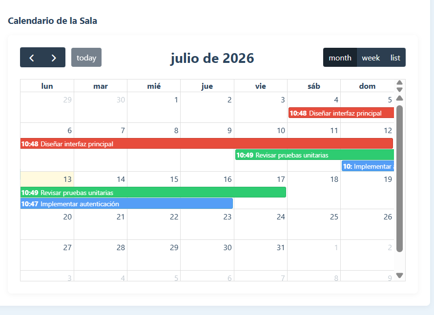
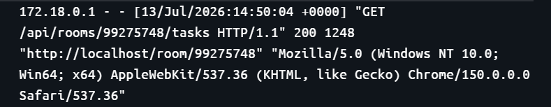
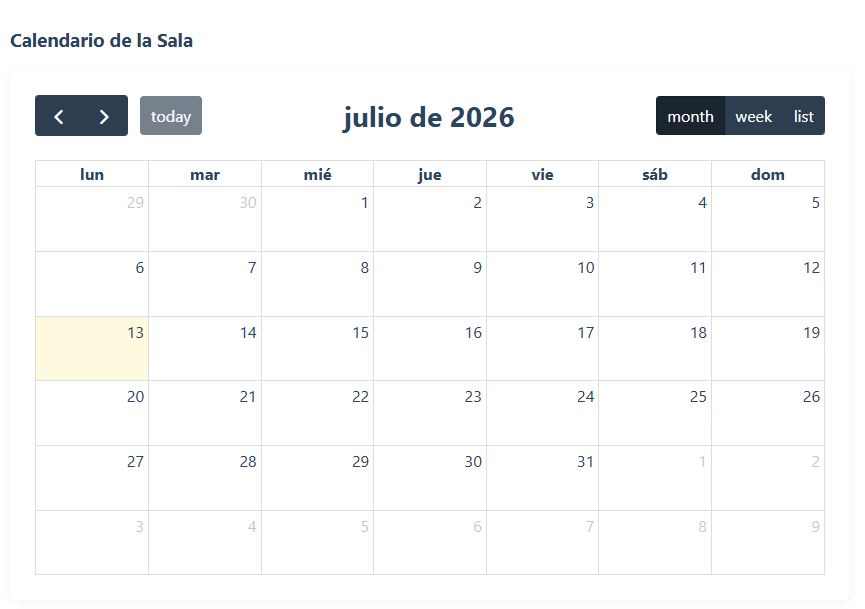

# Evidencias de integración del calendario

## Calendario con tareas

El calendario muestra las tareas registradas para la sala según su fecha de inicio y término. Además, utiliza una codificación por colores para facilitar su identificación:

- 🟢 **Verde:** Tarea completada.
- 🔵 **Azul:** Tarea pendiente.
- 🔴 **Rojo:** Tarea atrasada.

---

## Consumo del endpoint de tareas

La siguiente evidencia muestra el registro del backend al consultar el endpoint encargado de obtener las tareas de una sala. La respuesta **HTTP 200 (OK)** confirma que la solicitud fue procesada correctamente y que el calendario recibió la información necesaria para mostrar las tareas.

---

## Calendario sin tareas

Cuando una sala no posee tareas registradas, el calendario se muestra vacío, permitiendo que el usuario identifique fácilmente que no existen actividades programadas sin afectar el funcionamiento de la interfaz.

