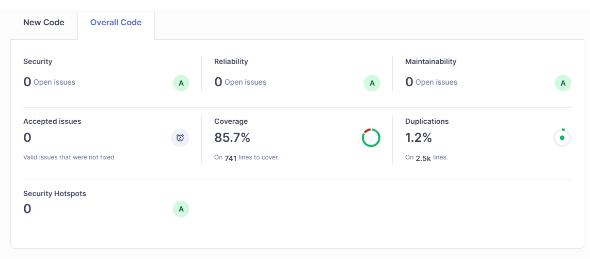
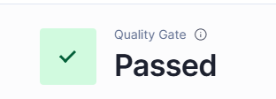

## Dashboard

El panel de SonarQube presenta un resumen del estado general de calidad del proyecto, incluyendo métricas de seguridad, confiabilidad, mantenibilidad, cobertura de pruebas y duplicación de código.

---

## Quality Gate

El Quality Gate verifica que el proyecto cumpla con los criterios de calidad definidos. En esta versión, el análisis fue aprobado satisfactoriamente.

